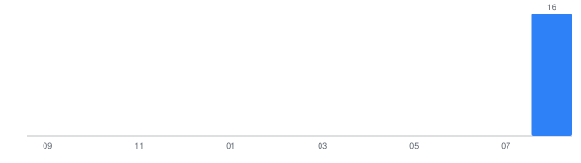

# My LeetCode Journey

An automatically maintained archive of my LeetCode solutions, synced automatically from my submissions by [`sync.py`](sync.py) (see [`.github/workflows/sync.yml`](.github/workflows/sync.yml)). Everything below the line is regenerated on every sync — see a problem's own README for where to add personal notes.

<!-- LC-SYNC:README-AUTO:START -->

## 📊 LeetCode Dashboard

_Last synced: 2026-08-29 03:52 IST_

### Overall Progress

| Metric | Count |
| --- | --- |
| Unique problems solved | **17** |
| Total submissions | 76 |
| Accepted submissions | 54 |
| Failed submissions | 22 |

### Difficulty

| Difficulty | Solved | % | |
| --- | --- | --- | --- |
| Easy | 17 | 100.0% | `████████████████████` |
| Medium | 0 | 0.0% | `░░░░░░░░░░░░░░░░░░░░` |
| Hard | 0 | 0.0% | `░░░░░░░░░░░░░░░░░░░░` |

### Languages

| Language | Solved | % |
| --- | --- | --- |
| C | 17 | 100.0% |

### Streak

🔥 **Current streak:** 0 day(s)  
🏆 **Longest streak:** 6 day(s)

### Recent Problems

| Problem | Difficulty | Language | Status | Date |
| --- | --- | --- | --- | --- |
| [Detect Capital](problems/0520-detect-capital/) | Easy | C | Accepted | Aug 27, 2026 |
| [Merge Two Sorted Lists](problems/0021-merge-two-sorted-lists/) | Easy | C | Accepted | Aug 23, 2026 |
| [Search Insert Position](problems/0035-search-insert-position/) | Easy | C | Accepted | Aug 19, 2026 |
| [Move Zeroes](problems/0283-move-zeroes/) | Easy | C | Accepted | Aug 19, 2026 |
| [Can Place Flowers](problems/0605-can-place-flowers/) | Easy | C | Accepted | Aug 19, 2026 |
| [Kids With the Greatest Number of Candies](problems/1431-kids-with-the-greatest-number-of-candies/) | Easy | C | Accepted | Aug 18, 2026 |
| [Merge Strings Alternately](problems/1768-merge-strings-alternately/) | Easy | C | Accepted | Aug 18, 2026 |
| [Remove Element](problems/0027-remove-element/) | Easy | C | Accepted | Aug 17, 2026 |
| [Palindrome Number](problems/0009-palindrome-number/) | Easy | C | Accepted | Aug 16, 2026 |
| [Remove Duplicates from Sorted Array](problems/0026-remove-duplicates-from-sorted-array/) | Easy | C | Accepted | Aug 16, 2026 |

### Weekly / Monthly / Yearly Progress

- This week: **1** unique problem(s) solved
- This month: **17** unique problem(s) solved
- This year: **17** unique problem(s) solved

### Monthly Activity

### Topics

Array (10), String (5), Two Pointers (4), Hash Table (3), Math (3), Stack (1), Bracket Sequences (1), Linked List (1), Recursion (1), Binary Search (1), Bit Manipulation (1), Greedy (1)

<!-- LC-SYNC:README-AUTO:END -->
